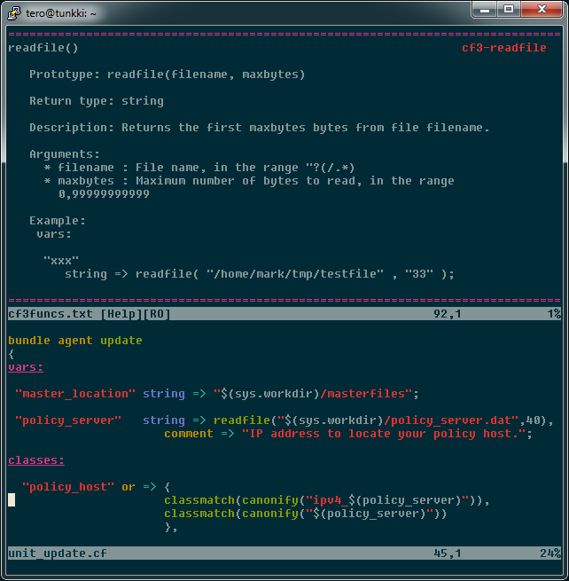

## Syntax Help Files for cf3_vim

These are meant to be used in conjunction with Neil's [vim_cf3](https://github.com/neilhwatson/vim_cf3).

----------



Contents of the help are dumped from:
* cf3funcs.txt
 * https://cfengine.com/docs/3.5/reference-functions.html
* cf3specialvars.txt
 * https://cfengine.com/docs/3.5/reference-special-variables.html

After placing the help files under your `~/.vim/doc/` you can call the functions through `:help`

All the syntax help *tags* are prefixed with `cf3-`. So if you'd like to get help for, say, `canonify` function; use `:help cf3-canonify`.

You can make this easier for yourself by adding this to `vimrc`.
```
:cabbrev cfhelp <c-r>=(getcmdtype()==':' && getcmdpos()==1 ? 'CFHELP' : 'cfhelp')<CR>
command -nargs=1 CFHELP call CfHelp(<f-args>)
function! CfHelp(query)
  exe ':help cf3-' . a:query
endfunction
```
It'll allow you to use straight up `:cfhelp canonify`, to get the same result as `:help cf3-canonify`
